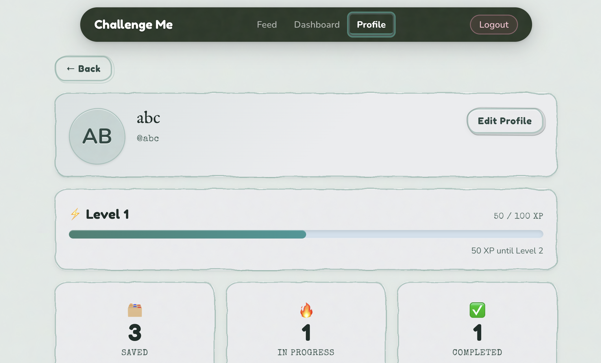
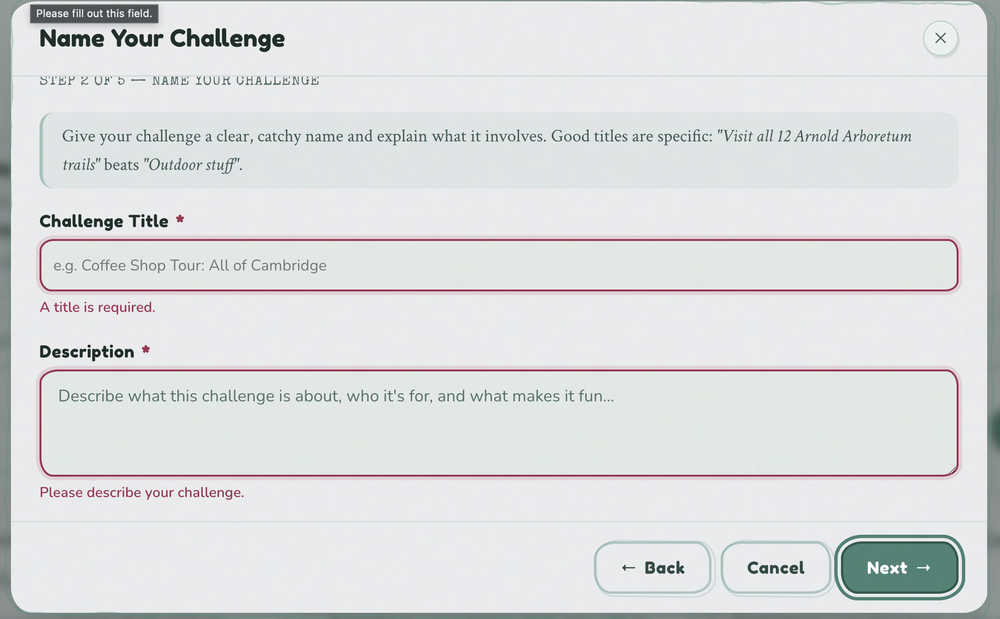

# 🏆 Challenge Me


A full-stack social web application that lets users challenge their friends, track scores, and compete across custom challenges. Built for CS5610 Web Development at Northeastern University. 

---

## 📋 Table of Contents

- [Deployed Link](https://challenge-me-fwme.onrender.com/)
- [Objective](#objective)
- [Features](#features)
- [Tech Stack](#tech-stack)
- [Installation](#installation)
- [API Overview](#api-overview)
- [Screenshots](#screenshots)
- [Design, Mockups, and Demo](#design-mockups-and-demo)
- [Attributions and AI](#attributions)
- [Authors and Course Information](#authors-and-course-information)

---

<h2 name="objective"> 🎯 Objective

### Course Objectives

Challenge Me is a full-stack web application built for CS5610 Web Development at Northeastern University. The project demonstrates:

- Building and consuming a RESTful API with Node.js and Express
- Integrating a NoSQL database (MongoDB Atlas) for persistent storage
- Implementing secure user authentication with Passport.js, bcrypt, and session cookies
- Building a dynamic frontend with React, Vite, and React Router
- Deploying a full-stack application to production

### Broader Objectives

Create a fun, competitive social platform that:

- Lets users create and issue challenges to friends
- Tracks scores and outcomes across completed challenges
- Provides a clean, responsive UI for managing challenge activity

---

<h2 name="features"> ✨ Features

### Authentication

Full user registration and login flow using Passport.js local strategy. Passwords are hashed with bcrypt and sessions are persisted with express-session.

### Challenges

Users can create challenges, send them to other users, and track whether they've been accepted, completed, or declined.
Update feature for Challenges works by editing the Steps in the Challenge, in the Feed page, 
Go to Feed-> Click on a Challenge -> and then expand the steps -> and click complete

### User Profiles

Each user has a profile that tracks their challenge history, wins, and standing among friends.

---

<h2 name="tech-stack"> 🔧 Tech Stack

### Backend

-  **Node.js** — Runtime environment
-  **Express** — RESTful API server
-  **MongoDB Atlas** — NoSQL database
- **Passport.js** — Local authentication strategy
- **bcrypt** — Password hashing
- **express-session** — Session management

### Frontend

-  **React 19** — Component-based UI
-  **Vite** — Frontend build tool
- **React Router v7** — Client-side routing
-  **Bootstrap 5 + React-Bootstrap** — Responsive UI components

### Development

- **Git** — Version control
- **ESLint + Prettier** — Code quality and consistency
- **Arch Linux + Neovim** — Development environment 😎

---

<h2 name="installation"> 💻 Installation

### Prerequisites

- Node.js (v18+)
- MongoDB Atlas account
- Git

### Setup

1. **Clone the repository:**

   ```bash
   git clone https://github.com/loganpaulmatheny/challenge_me.git
   ```

2. **Navigate to the project directory:**

   ```bash
   cd challenge_me
   ```

3. **Install dependencies:**

   ```bash
   npm install
   cd client && npm install && cd ..
   ```

4. **Configure environment variables:**

   Create a `.env` file in `server/`:

   ```
   MONGODB_URI=your_mongodb_connection_string
   SESSION_SECRET=your_session_secret
   PORT=3000
   ```

5. **Start the backend:**

   ```bash
   npm run dev:server
   ```

6. **Start the frontend (separate terminal):**

   ```bash
   cd client && npm run dev
   ```

7. **Open in browser:**
   ```
   http://localhost:5173
   ```

---

<h2 name="api-overview"> 🔌 API Overview

| Method   | Endpoint                                  | Description                              |
| -------- | ----------------------------------------- | ---------------------------------------- |
| `POST`   | `/api/auth/register`                      | Register a new user                      |
| `POST`   | `/api/auth/login`                         | Log in                                   |
| `POST`   | `/api/auth/logout`                        | Log out                                  |
| `GET`    | `/api/users`                              | Get all users                            |
| `GET`    | `/api/users/:id`                          | Get a user by ID                         |
| `POST`   | `/api/auth/login`                         | Log in                                   |
| `POST`   | `/api/auth/logout`                        | Log out                                  |
| `GET`    | `/api/auth/user`                          | Get currently logged-in user             |
| `GET`    | `/api/users`                              | Get all users                            |
| `GET`    | `/api/users/:id`                          | Get a user by ID                         |
| `GET`    | `/api/challenges`                         | Get all challenges (with creator info)   |
| `GET`    | `/api/challenges/:id`                     | Get a single challenge                   |
| `POST`   | `/api/challenges`                         | Create a new challenge                   |
| `POST`   | `/api/challenges/like/:id`                | Like or unlike a challenge               |
| `DELETE` | `/api/challenges/:id`                     | Delete a challenge (owner only)          |
| `GET`    | `/api/profile`                            | Get current user profile                 |
| `GET`    | `/api/profile/challenges`                 | Get saved challenges with progress       |
| `POST`   | `/api/profile/import/:challengeId`        | Save/import a challenge                  |
| `PUT`    | `/api/profile/complete-step/:challengeId` | Complete a step and update progress      |
| `DELETE` | `/api/profile/challenge/:challengeId`     | Remove (unsave) a challenge from profile |
| `GET`    | `/api/interactions/likes`                 | Get liked challenge IDs for current user |

---

<h2 name="screenshots"> 📸 Screenshots

|  |  |

|  |  |

---

<h2 name="design-mockups-and-demo"> 🎨 Design, Mockups, and Demo

#### [Design Document](https://docs.google.com/document/d/1gl6j5JnucDPkrzByfkcfNuCAizEFWbkN-eOAioEs_iA/edit?usp=sharing)

#### [Presentation](https://docs.google.com/presentation/d/1AM67vtAuLJtoZfiFd_NoQXPYV75k2VGY3fLCp5zUSgA/edit?usp=sharing)

#### [Demo](https://drive.google.com/file/d/1MBGVpu46Opq3qm3dbDpSdtCC7UuOp7Pp/view?usp=sharing)

---

<h2 name="design-accessibility"> ♿ Design & Accessibility Improvements

This iteration of the project focused on design quality, usability, and WCAG 2.1 AA compliance. Every component was audited with axe DevTools and Lighthouse.

### Color & Contrast

- Enforced a consistent design token system (`--ink-*`, `--ci-*`, `--fi-*`) across all components
- Fixed all text that failed WCAG AA contrast ratios:
  - Profile page stat labels, username, XP text: `--ink-400` → `--ink-500`/`--ink-600`
  - Dashboard stat delta badges: replaced `--ci-success` (3.0:1) with `--done-txt` (7.4:1)
  - Challenge card "Continue" CTA: `--ci-primary` → `--ci-primary-bdr` (3.4:1 → 5.9:1)
  - Logout button: added explicit background so contrast tools compute correctly; text updated to 7.9:1
- App uses a teal-primary palette (`#438173`) chosen for its calm, community-oriented feel; red/destructive actions use a distinct terracotta token

### Typography

- Enforced a 12px minimum across the entire app — every sub-12px instance was found and corrected (Badge, SegTabs, StepProgress, CreateChallengeModal, Dashboard stat cards)
- Display headings: *IM Fell English* (editorial, humanist)
- Body/prose: *Crimson Text* (legible serif)
- UI labels: *DM Sans* (clean, functional)
- Flavor/secondary: a handwritten-style font for ambient text

### Semantic HTML & Heading Hierarchy

- Fixed skipped heading levels (h1→h3 without h2) in Feed, Dashboard, and ProfileInfo
- Challenge card titles rendered as `<button>` elements (not `<div>`) so they are keyboard-focusable and announced correctly by screen readers
- In edit mode, card title renders as `<span>` to eliminate redundant interactive elements
- All icon-only buttons have explicit `aria-label`

### Keyboard Navigation

- Full tab-order traversal: Navbar → Feed filters → challenge cards → pagination
- All modals trap focus while open and restore focus on close
- Pagination buttons follow the ARIA pattern with `aria-current="page"` on the active page
- Dropdown filters are keyboard-operable with visible focus rings on all interactive elements

### ARIA & Screen Reader

- `sr-only` utility class used for page `<h1>` elements that are visually hidden but announced by screen readers
- Sections use `aria-labelledby` pointing to their visible heading rather than a duplicate `aria-label`
- Avatar fallback divs marked `aria-hidden="true"` — decorative, not announced
- Fixed invalid HTML: inline `<span aria-hidden>` was wrapping block-level `<div>` (now handled via a `decorative` prop on the Avatar component)
- Challenge card creator images: `alt=""` + `aria-hidden="true"` (decorative context)

### Layout & Rendering Fixes

- **Feed and Dashboard grids replaced `column-count` with CSS Grid** (`grid-template-columns: repeat(3, 1fr); align-items: start`). The `column-count` + CSS `transform` on hover combination caused cards to be clipped at column boundaries and visually disappear — a browser rendering bug that CSS Grid eliminates entirely.
- Responsive breakpoints at 900px (2 columns) and 500px (1 column) on both Feed and Dashboard

### Welcome & Onboarding

- Added a dismissible welcome banner on the Feed page explaining XP, leveling, and how to create challenges
- Banner state persisted in `localStorage` so it only shows once

---

<h2 name="attributions"> Attributions

## 🤖 AI Assistance

### How AI Was Used

A combination of Claude and Gemini were used throughout development as learning and debugging aids:

- Structuring the Passport.js authentication flow and understanding session lifecycle as well as how to leverage session state
- Assistance with React component and state management architecture
- Deployment configuration on Render

**README Documentation** — Claude AI was used to help structure and format this README based on project details and a preferred style from a prior project. The repository owners then made adjustments and modifications as necessary.

### AI Usage Philosophy

AI was used as a **development accelerator**, not a shortcut. All generated code was reviewed, understood, and integrated intentionally. The goal was to spend less time on boilerplate and more time learning.

---

<h2 name="authors-and-course-information"> 👨‍💻 Authors and Course Information
   
## Authors

**Logan Matheny**

- 🎓 Graduate Student, M.S. Computer Science — Northeastern University
- 🪖 West Point Graduate and U.S. Army Veteran
- 💼 [LinkedIn](https://www.linkedin.com/in/logan-matheny/)
- 🐙 [GitHub](https://github.com/loganpaulmatheny)

**Pratyusha Jaitly**

- 🎓 Graduate Student, M.S. Computer Science — Northeastern University
- 🐙 [GitHub](https://github.com/pratyushajaitly)

## Course Info

- **Course**: CS5610 Web Development
- **Semester**: Spring 2026
- **Instructor**: John Guerra Gomez
- **Course Website** — [CS5610 Online Spring 2026](https://johnguerra.co/classes/webDevelopment_online_spring_2026/)

---

## 📝 License

MIT License — see [LICENSE](./LICENSE) for details.

Thanks to [Freekpik](https://www.flaticon.com/free-icons/goal) for allowing us to use their logo for our thumbnail

---

**Made with 🤝 by Logan Matheny & Pratyusha Jaitly**

_Last Updated: April 2026_
